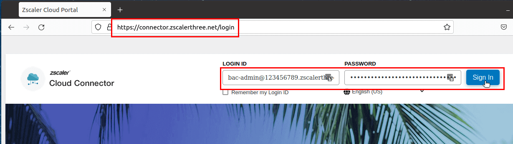
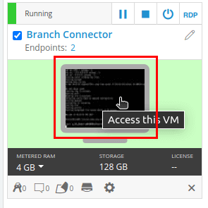

# Branch Connector Deployment

This guide shows how to deploy a Branch Connector in Skytap using the VMware Connector image.

## Attribution

The information in this guide is based on the instructions found here:

* [https://docs.google.com/document/d/1I9jh9brJhIEGyalA3I8cGe2Z2-GsXvzvCLUIzm6UpUI/edit](https://docs.google.com/document/d/1I9jh9brJhIEGyalA3I8cGe2Z2-GsXvzvCLUIzm6UpUI/edit)
* [https://drive.google.com/file/d/16mBHM-xzsWfkuPhmipdsUTAXh8KvnKi8/view](https://drive.google.com/file/d/16mBHM-xzsWfkuPhmipdsUTAXh8KvnKi8/view)

>These docs are NOT customer facing, but I put links here as attribution to those who built it.

## Lab Topology

In Skytap we've built a Template of VMs that will be the source for your lab topology.  Here is the Skytap Environment layout:

### Topology Description

Basically it is two client networks connected to a Core Router.  Prior to configuring the Connector VM, this topology has a floating static route (not shown in picture) in the Core Router that will forward traffic directly to the Edge Router. The goal of this guide is to have a default route that sends client traffic to the Connector VM which will then route through the tunnel to the Zscaler cloud network.

### Routing Description

The Edge Router is providing NAT and Internet access for the 192.168.0.0/16 network.  It has a static route for 192.168.0.0/16 pointing to the Core Router.  This route is needed to handle the return traffic from either the Internet.  This route will also be used after the Connector is configured to route traffic exiting the Connector VM that is destined for the client LANs.

The network between the Core Router and Edge Router is called the DMZ.  As you can see from the diagram the Connector VM will reside in this network.  At the end of this deployment the Core Router will have a default route pointing to the Connector VM.  The Connector VM will have a default gateway pointing to the Edge Router.

>An alternative to changing the default route would be to set up Policy Based Routing (PBR) and only change the routing for select source IPs/Subnets.

At the end of this deployment client traffic will be routed as follows:

1. The Client uses their default gateway to forward traffic to the Core Router.

2. The Core Router will use its static default route to forward traffic to the Connector VM.

3. The Connector VM will forward traffic through the tunnel to Zscaler.

4. The return traffic will exit the tunnel and use the Connector VM's default gateway to forward traffic to the Edge Router.

5. The Edge Router will use a static route for the Client LANs to forward traffic to the Core Router.

6. The Core Router will then send the traffic to the Client.

### Routing Alternatives/Issues

The above topology design is the best I could come up with given the rules/constraints of the Connector VM.  The Connector VM only supports DHCP for addressing.  It doesn't support providing static routes on it.  So, the Connector VM can only route traffic via its default gateway.  This default gateway has two purposes: Route to Zscaler to set up the tunnel, and then route return traffic to the client.  Thus, the burden of routing is put on the networking infrastructure of the branch equipment.

>I originally started a long rant about possible network design issues given the limits of routing on the Connector VM.  In short, be careful when discussing deployments of Branch Connector in your customer's networks.  Pay careful attention to the full round trip of client traffic.  If the Edge router can't provide routing back into the network (aka hair-pinning routing), or the branch has a collapsed design (a single device providing core and edge routing) you'll have to really take care about how/where to deploy the Connector VM (and probably use Policy Based Routing to accomplish the full routing solution).

## Accessing Connector Portal

>Your tenant might be on a different Zscaler domain than the one used in the wording and screenshots in the lab.  Please refer to your tenants credential information to ensure you are accessing the correct connector portal.

1. Open a browser and navigate to **https://connector.`<your-tentant-domain>`.net**.

    >My tenant is on the Zscaler Three domain thus my URL is: https://connector.zscalerthree.net.

2. Log into your Connector tenant using your credentials.  The username probably starts with **bac-admin@**.

    

## Create a Location Template

1. Granted, you can use the default template but let's create a custom one so that we can modify it without affecting other Connector deployments.  In the Connector Portal Navigate to **Administration > Location Templates** and click **Add Location Template**.
	
    

    

2. Provide the location template with a name, **skytap**, then scroll down and click **Save**.

    

    

## Build a Provisioning Template

1. Navigate to **Administration > Provisioning Templates**.

    

2. Select **Branch Provisioning** and click **Add Branch Connector Provisioning Template**.

    

3. Give the template a name, **skytap**.  Select the Hypervisor to use, **VMWare ESXi**, then and click **Next**.

    

4. Though we have a Location Template created, we need to build the Location.  Select **NEW** and fill out the information for the Location, then click **Next**.

    Location Name: **skytap**
    Country: **United States**
    Location Template: **skytap**

    

5. Select **NEW** to build a Branch Connector Group.  Provide it a **Name** and then click **Next**.

	

6. Leave the interface configuration to **Auto**.  Click **Next**.

	

    >When this guide was first written manually configuring the IP addresses was not supported.  This condition is expected to change.

7. Review and click **Save**.

	

8. Copy the Provisioning URL and save it somewhere.

	

9. In the lower-left corner (scroll down), click **Done**.

	

## Obtaining the VMware OVA File

**OBTAINING THE VMWWARE OVA FILE SECTION IS FOR INFORMATIONAL PURPOSES ONLY.  WE HAVE ALREADY UPLOADED THE OVA FILE INTO SKYTAP!**

You will find the VMware OVA file under **Administration > Branch and Cloud Connector**.

>Note: When I originally downloaded the OVA file my browser tab would "grey out" and appear to do nothing else.  Presumably the download is occurring, but I'm getting no indication of such.  Eventually the browser would return, and I'd have the OVA file in my Downloads folder.  The file is 1.6 GB in size, this can take some time.

Once downloaded, you'll then deploy the OVA into your VMware environment as a VM.  Again, this process has already been done for you in Skytap and all this work is in the Skytap Template we are about to deploy.

## Deploy Skytap Environment from Template
1. In Skytap, navigate to **ENVIRONMENTS > Templates > All** and search for **Branch Connector Lab**.

    

    >You may see other people's Templates.  You can narrow your search by also ensuring **Dax Mickelson** is the **Owner** of the Template.

2. On the correct Template, click **New environment** and select **Deploy as new environment** from the dropdown menu.

    

3. Give the new environment a name.  (I prefer to reference the tenant domain in the name.)  Click **Deploy** when ready.

    

4. Deployment will take a bit as the underlying VMs are cloned.  Once the deployment is done click the **Start** arrow to boot up the VMs.

    

    >VM startup order and delays are intentional so that routers boot up and are ready for use (like as a DHCP server) before the host VMs start.

## Configure the Branch Connector VM
1. When available, about 3-4 minutes after clicking Start, the Branch Connector VM will become clickable.  Click the image for the Branch Connector VM to open a console to it.  This will open up a new tab in your browser.

    
 
1. Log into the OS with username **zsroot** and password **Zrelacs321**.  Issue the command `ifconfig` to learn what IP the server obtained for its **Management IP**.  Take note of this IP as we will need it soon.

    

    >Your VM's Management IP might be different, but it should be on the 192.168.255.0/24 network as that is the DMZ network in this topology.

1. Now open the console to the **Client-A** VM.  Click **Remind me later**/**Skip** (or whatever) to get past all the Windows setup junk.  Get to the Desktop of the VM.

    

1. On the Desktop of Client-A there are two files of importance.  The **userdata.cfg** is the file that needs some information about your specific configuration (we will be editing it soon) and the **Move File to Branch Connector.bat** file will be used to copy the userdata.cfg file into the right place on the Connector VM.  **Edit** the **userdata.cfg** file by double-clicking it or by right-clicking it and selecting Edit.

    

1. Replace the bracketed sections with the information requested.  **Save** and close the Notepad editor when finished.

    * **cc_url**: The Provisioning URL created when you built the Provisioning Template earlier in this guide.
    * **api_key**: The API key can be found/created in the Connector tenant GUI under **Administration > API Key Management**.
    * **username**: Your Connector tenant's admin username.
    * **password**: Your Connector tenant's admin user's password.

    

    >Note: This file **MUST** use the Unix end of line endings and not the Microsoft line endings.  So, we've enabled the ability to see the normally *hidden* code.  This is why we are using Notepad++ instead of just Notepad on Windows.  Additionally, we modified Notepad++ to use Unix style line endings by default.

    >Note: If you need to recreate this file in your own environment we have a [userdata.cfg](../assets/user-data.cfg) file for reference.

2. Edit the **Move File to Branch Connector.bat** file by right-clicking the file and selecting **Edit** from the dropdown menu.

    

3. Update the **set branch_connector_ip=192.168.255.X** line to use the Management IP of your Connector VM.  **Save** and close the Notepad editor when finished.

    

4. Double-click the **Move File to Branch Connector.bat** file to execute that script.  This will open a CMD prompt, SSH to the Connector VM, and copy the userdata.cfg file into the correct location for operation.  When prompted, type **yes** to continue connecting.  Then, when prompted, type in the password of **Zrelacs321**.

    

    >This batch script copies the userdata.cfg file into /etc/cloud/cloud.cfg.d directory on the Connector VM.

5. Return to the Branch Connector's console.  Type `sudo service janus restart` to force janus to re-read the directory, see the userdata.cfg file, and start executing the provisioning using the information therein.

    

    >This step is technically optional as janus will occasionally check this directory for existence of the userdata.cfg file.  Manually restarting janus will just speed up the process.

    >Even after the janus service has restarted it will be several minutes (15+ minutes) before the service is fully functional.  If the service has software updates it might even reboot the VM during this process.

12. You can close the browser tab open to the Branch Connector VM's console.  We won't be accessing this VM anymore.

## Obtaining Service IP

1. Log into your Connector tenant portal.  The landing page should be the **Dashboard** page.  Once the recently configured branch connector is finished updating the **Active Status** section of the Dashboard should report an **Active** connection.

    

2. Return to Client-A and edit the **Get Branch Connector Service IP.bat** file and update the **branch_connector_ip** to the **Management IP** like before.

    

    

    >This script won't work until this branch connector VM has established its connection to the Zscaler Connector service and has updated.  The **/sc/instances/...* path won't even exist until this state has been reached!

1. Run the **Get Branch Connector Service IP.bat** file.  Provide the password **Zrelacs321** when prompted and take note of the IP address outputted.  This is your Branch Connector's **Service IP**.  This is the IP we will use to change the default route in the Core Router in the next section.

    

## Network Setup

Branch connector needs to be the *default gateway* for all traffic that is to go through it into the Zscaler cloud.  However, the VM itself cannot be its own default gateway.  Since we left the interface configuration to *Auto* (static/manual configuration of the interfaces is not yet supported) we need to configure the LAN (vlan) where we will put this VM with a DHCP pool.  This leaves us in a weird situation for other devices on that same LAN.  The Branch Connector VM will DHCP for its networking information (which is where we will get the default gateway info) BUT all other devices should NOT use that DHCP gateway information.  So, I'm using a dedicated LAN, the DMZ, for this purpose. The DMZ is a network that sits in-between my users LANs and my edge router.

The second NIC on the Branch Connector VM is the Service NIC.  This is where all the user traffic is sent/received.  The IP assigned to this interface will not be visible to VMWare, so, without using a DHCP reservation, this IP can/will change over time.  This will cause havoc with routing.  Thus, creating a reservation for this NIC's MAC address is preferred. Unfortunately, I could not figure out how to create a DHCP reservation for this MAC in the Cisco CSR1000v (Core Router).  **This means you need to double-check the Service IP each time you boot up your Skytap environment and make sure it aligns with the default static route we are about to create in the Core Router.**

1. In the Skytap UI, access the Core Router's console.

    

4. The console won't automatically update.  Click in the blackness of the console and press enter.

    >The router's default access should give you ENABLE access but just in case the password is **Admin-123!**.

    

5. Issue the command `show ip route` and/or `show run | in ip route` to view the current default route.  You should notice that it points to the Edge Router and that it has an administrative distance set to 250.  (This way, when we write the new default router pointing to the Service IP of the Branch Connector VM we don't have to remove the current default route.)

    

6. Issue the following commands to set the new default route.  This route will be used by all the client networks and will forward their traffic to the Service IP of the Branch Connector VM.

    `conf t`

    `ip route 0.0.0.0 0.0.0.0 <Service IP>`

    `end`

    

    >Note: It's your choice whether to save this change to NVRAM of the router or not.  If you do then in future boot ups of this Skytap Environment may lead to the Service IP getting a different IP but the Core Router's route will still point to this "old" IP.  You'll need to come back in and undo this route and write a new route pointing to the new Service IP.
    > 
    >If you choose NOT to save this router's configuration than each time you boot up this environment you'll need to figure out the Service IP and write a default route to point to it.
    > 
    >In the real world this would be mitigated by created a DHCP reservation for the MAC address of the Service NIC of the Branch Connector VM.

7. Re-issue the command `show ip route` and see that the preferred default route now points to the Service IP.

    

## Verification and Testing

#### Test 1: Using the Connector Portal UI

1. Access the Connector Portal and navigate to the **Dashboard**.  From there you should be able to see how many Connector tunnels are connected.  (I happen to have a few as I've been testing already.)

    

2. You probably don't have much (or any) traffic going through the Connector as yet, but you can view information about said traffic on the **Traffic Monitoring** tab on the **Dashboard** page.

    

### Test 2: Using the Client VMs in Skytap

1. In Skytap, open the console to the Client-A VM.

    

1. On the Desktop of Client-A open a browser and access https://ip.zscaler.com.  (There is a bookmark saved for it.)  Notice that it will show that you are going through the Zscaler cloud.

    
