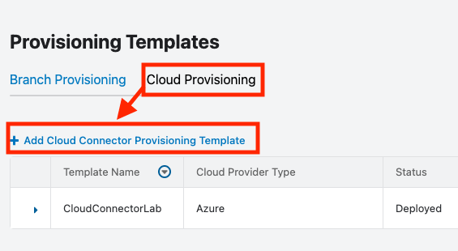
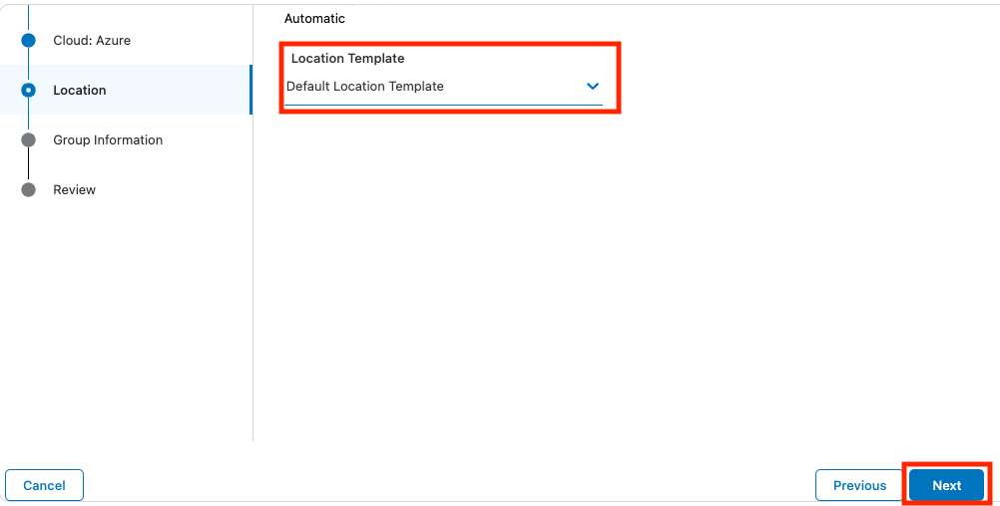
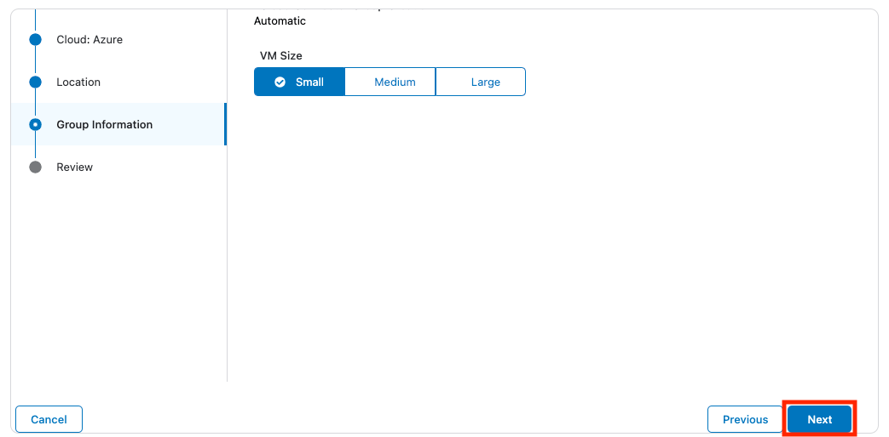
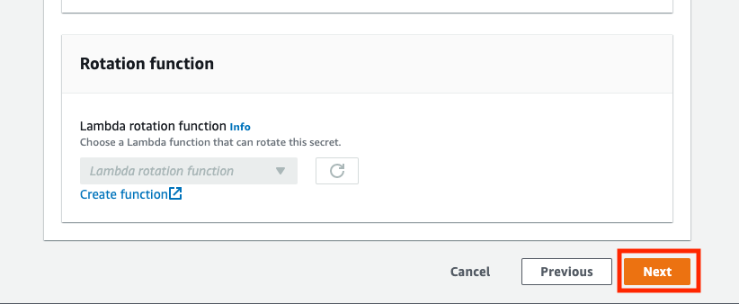
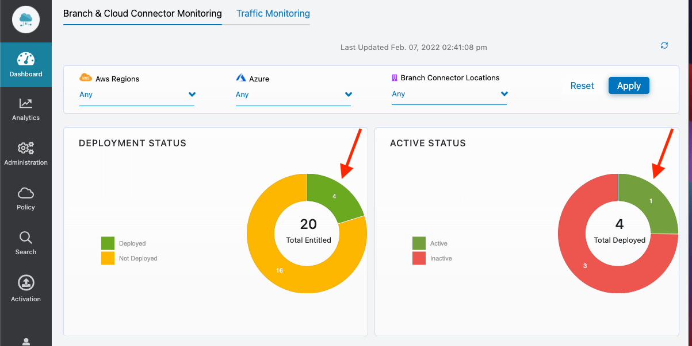

# AWS Cloud Connector Deployment

This guide will walk you through deploying a Cloud Connector within your AWS account via the Cloudformation template available in your Cloud Connector tenant. The Cloudformation template handles deploying the Cloud Connector to an existing Virtual Private Cloud (VPC).  This lab also walks through setting up a VPC in the AWS UI in which to deploy the Cloud Connector.

>Cloudformation deploys a virtual machine and associated services needed for it to run properly, like network interfaces and security groups.

## Lab Prerequisites

- You must have admin access to your own AWS account (Zscaler currently does not have AWS accounts that you can leverage).

- In order to use the Zscaler Cloud Connector AWS Marketplace product **you need to accept terms and subscribe**. To do so please visit [https://aws.amazon.com/marketplace/pp?sku=2l8tfysndbav4tv2nfjwak3cu](https://aws.amazon.com/marketplace/pp?sku=2l8tfysndbav4tv2nfjwak3cu){target=_blank}

- Your own Cloud Connector tenant has been provisioned, and you've created an API Key in that tenant.

    >To provision a Cloud Connector tenant you will need to raise a support request at [https://help.zscaler.com/submit-ticket](https://help.zscaler.com/submit-ticket){target=_blank}. Choose **Provisioning** as the Case Type and use **your OrgID** in the Zscaler Company ID field.

## AWS Conventions

### AWS Region

AWS has a concept of regions. You will want to select the appropriate region in the upper right-hand corner of the AWS UI.  Use this same region for all services you configure during this lab. The Cloud Connector is available in all AWS regions. 

### Accessing AWS Services

There are multiple ways to locate services in AWS.  Throughout this lab we will configure a number of different services. One way to quickly locate services is via entering text in the search box at the top of the UI. It will display a list of matching services, from which you can click on the service to access its landing page. Throughout the course of this guide there will be instructions such as **navigate to VPC service** or **navigate to Cloudformation service**, and you can use the search box (or other preferable means) to navigate to the service.

## Setup AWS VPC

To simplify the creation of the VPC we are going to use AWS's VPC launch wizard to automatically create the VPC and associated resources, like subnets, Internet Gateway, NAT Gateway, and route tables.

Zscaler supports deploying Cloud Connector in both public and private subnets.  However, it is recommended to deploy the Cloud Connector in a private subnet, and we will follow that convention in this guide.

The VPC we deploy, via the wizard, will have a public and private subnet. The VPC route table will have a default route pointed to a NAT gateway allowing EC2 instances in the private subnet, like the Cloud Connector once we deploy it, to communicate with the Internet. The public subnet will have its own associated route table with a default route that points directly to the Internet gateway. We will not be using the public subnet in this guide.

### Create VPC

It is time to use the VPC wizard!

1. Use the left-hand side navigation to navigate to the VPC Dashboard. Click the **Launch VPC Wizard** button on the VPC landing page.

    

1. The AWS VPC Wizard recently changed to a new workflow.  All the settings that use to be on multiple screens are now displayed in **VPC settings** column along the left side of the screen.  As you set/change values here the right side of the screen will update.  Set the following values and then click **Create VPC**.

    * Resources to create: **VPC, subnets, etc.**
    * Name tag auto-generation: **CloudConnectorLab**
    * IPv4 CIDR block: **10.0.0.0/16**
    * IPv6 CIDR block: **No IPv6 CIDR block**
    * Tenancy: **Default**
    * Availability Zones (AZs): **1**
    * Number of public subnets: **1**
    * Number of private subnets: **1**
    * NAT gateways ($): **In 1 AZ**
        
        >Note: AWS charges for NAT gateways.  Be sure to clean up your NAT gateway configurations when you are done with it.

    * VPC endpoints: **S3 Gateway**
    * DNS options: **Uncheck both options**

    

### Availability Zone Name 

You now want to save the availability zone name of the private subnet.  The availability zone will be required information when deploying the Cloud Connector via Cloudformation. 

1. On the left-hand navigation of the VPC, click on **Subnets**.

1. Check the box for your Private Subnet.

1. Under **Details** find the availability zone.

    

## Cloud Connector Tenant

You will now need to log into your Cloud Connector tenant and grab a couple of pieces of information as well as provision a location template.

### CloudFormation Template

1. Open a browser and navigate to **https://connector.`<your-tentant-domain>`.net**.

    >Your tenant might be on a different Zscaler domain than the one used in the wording and screenshots in this guide.  Please refer to your tenants credential information to ensure you are accessing the correct connector portal.  (You probably won't be able to log into the wrong one.)

2. Log into your Connector tenant using your credentials.  The username probably starts with **bac-admin@**.

    

1. Download a Cloudformation template. This template will be uploaded into the AWS UI and will allow you to quickly provision all the services required for a functioning Cloud Connector.  Click **Administration > Deployment Templates** in the left-hand navigation.

    

1. Click **Starter Deployment Template** under **AWS > AWS CloudFormation**.

    

1. You should now have a file called **zs_cc_cf_template_simple.yaml** downloaded on your computer. Make a note of the location as this file will be uploaded to the AWS UI in subsequent steps.

### Provisioning Template

Now create a basic provisioning template to use for deployment of the Cloud Connector. 

1. Use the left-hand navigation and select **Administration > Provisioning Templates**.

    

1. On the Provisioning Templates screen click the **Cloud Provisioning** tab and then click the **Add Cloud Connector Provisioning Template**.

    

1. On the Name screen, use **CloudConnectorLabAWS** for the name and click **Next**.

    > Note, to click the **Next** button you may have to scroll down depending on your screen resolution.

    

1. On the Cloud screen, select **amazon web services** and click **Next**.

    

1. On the Location screen, select **Default Location Template** and click **Next**.

    

1. On the Group Information screen, leave default selection of **Small** and click **Next**.

    

1. Finally, on the Review screen, review the information and then click **Save**.

    

2. You now should see a message indicating **All changes have been saved**. There will also be a link to **Copy Provisioning URL**. Click that URL and then save it in the same place you saved the availability zone name of your subnet. You will need this URL when deploying the Cloud Connector via the CloudFormation template.

    

### API Key

Grab the API key from the portal. 

1. Navigate to **Administration > API Key Management**

    

1. Copy the value under **Key** and save it.
   
   >If you haven't created a key take the time now to do so.

## AWS UI

Log into the AWS UI and select the region where you configured your VPC. Two things need to be done in AWS prior to launching the Cloud Connector. You will need to:

1. Generate a key pair for use with the Cloud Connector EC2 instance (if you do not already have one available).

2. Use AWS Secrets Manager to store secrets for the Cloud Connector.

### Key pair

You need to assign a key pair to the virtual machine when deploying the Cloud Connector via the Cloudformation UI.  Key pairs in AWS are region specific.  So, if you do not have a key pair in this region, create one.

1. Navigate to the **EC2 Service** page.

1. Scroll down on the left-hand navigation and select **Key Pairs**.

1. Click **Create key pair**.

    

1. On the Create key pair page enter in **CloudConnectorLab** for the name, and leave the rest of the options as the default values, and click **Create key pair**.

    

### Secrets

You are now going to store secrets the Cloud Connector will use to authenticate with Zscaler. These secrets will be pulled in automatically when the Cloud Connector is deployed via CloudFormation.

1. Navigate to the **Secrets Manager** service, and click **Secrets** in the left-hand navigation

    >You may automatically land on the Secrets page.  In which case you don't need to click on the left-hand navigation.

    

1. Click on **Store a new secret** to launch a wizard which will guide you through 4 steps. 

    

1. We need to create three key/value pairs in this screen. You will use your username and password values from the Cloud Connector tenant login, and you copied the API key from the Cloud Connector tenant in a previous step.  Fill in the following values and then click **Next**.

    > Note, the screenshot below doesn't show the actual values. Be sure to enter the appropriate values.

    - Secret Type: Choose the radio button for **Other type of secret**.

    - Key/value pairs: Enter your **username**, **password**, and **api_key** values.

    - Encryption key: Leave default value of **DefaultEncryptionKey**.

    

1. Provide a **Secret name**, CloudConnectorLab for example, and click *Next*.

    

1. Leave the Rotation function settings at the defaults. Click **Next**.

    

1. Those of you interest in how to access the Secrets via API and tab through the shown languages to get an idea on what code is necessary.  Click the **Store** button to save the secrets. 

    

### Cloudformation

Now you are going to deploy the Cloud Connector and associated resources via the Cloudformation service.

1. Navigate to the **CloudFormation** service and click on **Create stack > With new resources (standard)** to launch a new stack.  This will walk through 4 steps to deploy the Cloud Connector. 

    

1. On the Specify template page fill out the following and then click **Next**.

    - Prepare template: Leave the default radio selected (Template is ready).
    - Template source: Select **Upload a template file**.
    - Click **Choose file** to select the file zs_cc_cf_template_simple.yaml (which you downloaded from the Cloud Connector portal in previous section).

    

2. Specify stack details and then click **Next**.

    - Stack name: **CloudConnectorLab**
    - VPC ID: Select the **CloudConnectorLab** VPC you provisioned earlier.
    - Availability Zone: Select the availability zone of your Private subnet. If unsure, select the subnet first, and then find the availability zone without an error in the UI.
    - Subnet ID of Zscaler Cloud Connector: Select the **Private subnet** which was provisioned when you create the VPC earlier.
    - Zscaler Cloud Connector Instance Key pair: Select your keypair you created earlier.
    - Zscaler Cloud Connector instance type: Leave default selection of t3.medium.
    - Cloud Connector Provisioning URL: Paste the provisioning URL you copied earlier.
    - Secrets Manager Secret Name: Enter **CloudConnectorLab**.
    - HTTP Monitor Probe: Leave blank.

    

    

1. Leave the Configure stack options at the defaults and click **Next**. 

    

1. At the bottom of the screen, under Capabilities, you will need to check the checkboxes.  Then click **Create stack**.

    

1. Cloudformation will now launch all the associated resources as defined by the template you uploaded. This can take up to 5 minutes.  You will see the text on the left-hand side under CloudConnectorLab change from **CREATE_IN_PROGRESS** to **CREATE_COMPLETE**.

    

## Confirm Cloud Connector Launched

1. After your Cloudformation stack is complete, log into the Cloud Connector tenant.  On the Dashboard screen you should see the Deployment Status and Active Status pie charts update to show 1 Cloud Connector deployed and Active.

    >Note, it can take up to 15 minutes to appear in the Cloud Connector portal from the time you first deploy via the Cloudformation template. During deployment, you may also see the Deployment Status pie chart show the Cloud Connector as deployed, while the Active Status pie chart shows the Cloud Connector as inactive. Give it a few minutes, and it should turn to active.

    

1. At the bottom of the Dashboard screen you should see a Cloud Connector in the table that has a name that starts with *zs-cc-vpc*. 

    

## Clean up

Once you have completed the lab, and you may want to decommission the Cloud Connector for cost reasons.

1. In AWS, navigate to the CloudFormation service.  Find the stack you created and delete the stack. This will remove the EC2 instance as well as associated resources.

>While VPCs, subnets, and route tables do not incur a charge, there is a charge for having a provisioned NAT Gateway and there may be charges for the Elastic IP address. You may want to delete these resources as well (Note, you need to delete the Cloud Connector cloud formation stack first as well as the NAT Gateway before deleting the VPC).  

## Additional Steps

Now that you have successfully deployed a Cloud Connector, you can deploy a workload and route its traffic through the Cloud Connector and into ZIA. You should have enough experience working with the Cloud Connector to do it on your own.

- Create a new private subnet for your workloads within the VPC.

- Create a route table associated to this new private subnet and have a default route to the ENI of the Cloud Connector.

- Spin up an EC2 instance in the workload private subnet and generate traffic.
