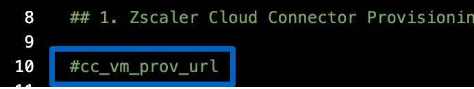
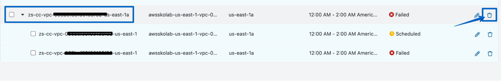

# AWS Cloud Connector Deployment via Terraform

## TL;DR

Zoltan did a wonderful [video recording](https://www.loom.com/share/b58eedb1912742c7a115434ec72c476e){target=_blank} that covers this lab.  Refer to this video for further explanation/clarification of the following steps.

## Prerequisites

- Access to your AWS Account using a web browser.
- Access to your Cloud Connector account using a web browser.
- Any text editor.

## Tips

- Use multiple tabs in your browser for the various AWS services.
- Make sure the prerequisites are completed. If you forgot to complete any of these steps, just follow the instructions in the [prerequisites guide](https://docs.google.com/document/d/1zFqn9zLwAF4q-b18oqM2pnjozDPnwjhIzoDNmm1xKfk/edit#heading=h.yvb6k2emyulu){target=_blank}.
- Copy/paste the following template and fill it in with your data for faster access during the lab:

```
Your AWS Account Login URL, AWS Account ID or Account Name: 
Your AWS IAM Username: 
Your AWS Access Key ID: 
Your AWS Secret Access Key: 
Your Cloud Connector Admin URL ( https://connector.<zscalercloud>.net ): 
Your Cloud Connector provisioning credentials: 
Your Cloud Connector Provisioning URL: 
Your Cloud Connector API Key: 
AWS Secret Name: ZS/CC/credentials/awsskolab
```

## Prepare Cloud Connector Configuration

1. Open your favorite text editor.
2. Log into your Cloud Connector Tenant (Your Cloud Connector Admin URL).
3. Navigate to **Administration > Provisioning Templates**.
4. Click the expand button next to the **awsskolab template**.
5. Copy the Provisioning URL and paste in your text editor.

    

1. Navigate to **Administration > Deployment Templates**.
2. Click the **Start Deployment Template with Gateway Load Balancer (GWLB)** option in the **AWS > Terraform** section. This will download the **zs_cc_tf_gwlb.zip** file.

    

1. Rename the file to **zscc-base.zip**.
2. Copy/duplicate the zip file to **zscc-custom.zip**.

    >Why are we doing this? For this lab the zssc-base template will be used to deploy the simulated customer environment (VPC). The zss-custom will be used to deploy the Cloud Connectors. This also shows how the same Zscaler Terraform template can be used for different deployment scenarios.

## Prepare AWS

The Zscaler Terraform templates come with a bash script which can only run on macOS and Linux. For simplicity, we are going to use the AWS CloudShell to accommodate our Windows users.  macOS users are welcome to execute the Terraform deployment scripts locally as well.  However, the safest option for this lab is to use CloudShell.

1. Log into your AWS Account using the IAM User you created during the prerequisites. The URL will be similar to: <https://1234567890.signin.aws.amazon.com/console>.

    >Forgot the account login URL?  [Login from here](https://console.aws.amazon.com/){target=_blank}.

1. The Region should already be **(US East) N. Virginia**.

    >If not, please change it now and double-check the AWS Secrets you created in the prerequisites are in this region! This lab depends on the secrets being accessible from the same region.

    

1. Open a **CloudShell window**. This is the terminal/command icon at the top.

    

1. Click **Do not show again** and **Close** on the Welcome to AWS CloudShell screen.

## Deploy the Base Lab VPC Environment

1. While in the AWS CloudShell, click **Actions > Upload file**.

    

1. Click **Select file** and navigate to the **zscc-base.zip** file.  Then click **Upload**.
2. **Unzip** the file: `unzip zscc-base.zip -d zscc-base`
3. Change into the directory: `cd zscc-base`
4. Make the script executable: `chmod +x zsec`
5. Run the deployment script: `./zsec up`
1. Type in the following **Deployment Type: base**.

    >For people running into the "query returned no results" error.  Edit the following two files:
    >
    >  - tfdir/modules/terraform-zsbastion-aws/main.tf
    >  - tfdir/modules/terraform-zsworkload-aws/main.tf
    >
    >Replace lines 6-10 (ish) with:
    >
    >    ```
    >    data "aws_ami" "centos" {
    >    most_recent = true
    >    filter {
    >        name   = "image-id"
    >        values = ["ami-0e2031728ef69a466"]
    >    }
    >    owners = ["amazon"]
    >    } 
    >    ```
    
    >Another alternative: Instead of providing you with another image that could eventually run into the same problem, you can customize this to your own environment. Go to the AWS Dashboard and launch a new EC2 insurance (make sure you're in the right region). Select a Linux template to your liking and note down the ami Id and owner. Then go back to the cli and rerun the aws command, using the new ami value. If it returns one or more results, use this value in the two .tf file (also change the owner if it's different).

    >
    >
    >

2. Enter your **AWS Access Key** created during prerequisites.

    >This should have been downloaded as a csv file. If you lost these credentials you can create a new Access Key by navigating to **AWS > IAM**.  Select your user and create access key.

3. Enter your **AWS Secret Key** created during prerequisites.
4. Enter the following **AWS Region: us-east-1**.  Terraform will initialize. This will take a few moments.

    

5. Enter your **Cloud Connector Provisioning URL**.

    >Note: there is no http:// or https:// prefix for the URL.

6. Enter the **AWS Secret Name: ZS/CC/credentials/awsskolab**

    

7. The Terraform plan shows so that you can confirm resources it will create. Type **yes** to deploy.

    

    >This will take a few minutes and will display **Apply complete! Resources: 26 added, 0 changed, 0 destroyed** and some additional outputs that are saved.

## Cloud Connector Deployment

Now we are going to do a custom deployment which is what you will most likely encounter in the field as customers want to deploy into existing environments. The customization of Terraform deployments is nearly endless, so this will be just one example. We will deploy a pair of Cloud Connectors with a Gateway Load Balancer (GWLB) into the previous deployed greenfield VPC and then route the workload subnet to it.

Customers will create new subnets for Cloud Connectors in most POVs, thus we will do this part manually. For simplicity, we are using a single subnet in a single Availability Zone, but most deployments will use 2 AZs.

## Create Cloud Connector Subnet

1. Click into the **AWS search bar**, type **vpc**.  Then **right-click VPC** and select **Open Link in New Tab**.

    

1. Click **Subnets** from the left menu.
2. Click **Create subnet**.
3. Input the following:
    - Select the VPC created, it will start with **zsdemo-vpc1**.
    - Subnet name: **cloudconnectors-subnet**
    - Availability Zone: **US East (N. Virginia) / us-east-1a**
    - IPV4 CIDR block: **10.1.2.0/24**

    

7. Click **Create subnet**.

## Configure the Terraform Variables

When deploying Cloud Connectors into an existing environment you will need to specify the required information so Terraform knows where to deploy to. Engineering team is working on some simplified deployment scripts that will prompt for all this information interactively, but it really just fills in all these same variables. This experience will give you hands on to see what information is needed and where to obtain it from!

>Note/Hint: **It is critical you uncomment all the specific lines mentioned here otherwise the deployment might fail.** Also double check all variables you replace to ensure the defaults are not in place unless specified in these instructions.

Example Original:



Example Uncommented (just remove the preceding #):


1. In the **AWS CloudShell**, return to the home directory: `cd ~`

    

1. On your local machine, **unzip** the **zscc-custom.zip** file.

    >Alternatively, you can modify the Terraform variables using vim in AWS CloudShell instead of locally:
    >
    >    - Upload **zscc-custom.zip** to AWS CloudShell
    >    - unzip it: `unzip zscc-custom.zip`
    >    - Change into the directory: `cd ~/zscc-custom`
    >    - Edit the file: `vi terraform.tfvars`
    >    - Uncomment and replace the variables as described in the instructions below
    >    - Save and quit vim when completed: `:x!`

2. Navigate into the **zscc-custom** directory and open the **terraform.tfvars** file with your favorite text editor. The rest of this section will mostly cover the changes you will make to this file.
3. In section 1, uncomment **#cc_vm_prov_url** and replace the example Provisioning URL with **your provisioning URL**.

    

4. In section 2, uncomment **#secret_name** and replace the example **Secret Name** with **ZS/CC/credentials/awsskolab**.

    

5. In section 3, uncomment **#http_probe_port** and use the default port, **50000**.

    

6. In section 8, uncomment **#az_count** and change the count to **1**.

    

7. In section 9, uncomment **#cc_count** and leave the default count of **2**.

    

8. In section 14, uncomment **#byo_vpc** and leave the default value of **true**.

    

9. In section 15, uncomment **#byo_vpc_id** and replace the example **VPC ID** with the one created earlier.

    >To obtain the VPC ID:
    >
    >    - Navigate to the **AWS Web Console > VPC service**.
    >    - Click Your **VPCs** from the left menu.
    >    - Select the VPC starting with **zsdemo-vpc1** and **copy** the **VPC ID** displayed.
    >    - Replace the example VPC ID in terraform.tfvars with the one you copied.

    

    

10. In section 16, uncomment **#byo_subnets** and leave the default value of **true**.

    

11. In section 17, uncomment **#byo_subnet_ids** and replace the example **Subnet ID**.

    >To obtain the Cloud Connector Subnet ID:
    >
    >   - Navigate to the **AWS Web Console > VPC service**.
    >   - Click **Subnets** from the left menu.
    >   - Select **cloudconnectors-subnet** and **copy** the **Subnet ID** displayed.
    >   - Replace the example Subnet ID in terraform.tfvars with the one you copied.

    

    

12. In section 18, uncomment **#byo_igw** and leave the default value of **true**.

    

13. In section 19, uncomment **#byo_igw_id** and replace the example **Internet Gateway ID**.

    >To obtain the Internet Gateway ID:
    >
    >   - Navigate to the **AWS Web Console > VPC service**.
    >   - Click **Internet gateways** from the left menu.
    >   - Select **zsdemo-vpc1-igw** and **copy** the **Internet gateway ID** displayed.
    >   - Replace the example IGW ID in terraform.tfvars with the one you copied.

    

    

14. In section 20, uncomment **#byo_ngw** and leave the default value of **true**.

    

15. In section 21, uncomment **#byo_ngw_ids** and replace the example **NAT Gateway ID**.

    >To obtain the NAT Gateway ID:
    >
    >   - Navigate to the **AWS Web Console > VPC service**.
    >   - Click **NAT gateways** from the left menu.
    >   - Select **zsdemo-vpc1-natgw** and **copy** the **NAT gateway ID** displayed.
    >   - Replace the example NGW ID in terraform.tfvars with the one you copied.

    

    

16. **Save** and **close** the terraform.tfvars file.

    > It is **highly recommended** you review (or peer review) the terraform.tfvars lines before the next steps just to make sure there are no mistakes or typos.

17. On your local machine, **delete** the original **zscc-custom.zip** file.
18. **Right-click** the **zscc-custom directory** and select the option to **compress/zip**.  This will create a new zscc-custom.zip file that contains the modified terraform.tfvars file.

## Deploy Cloud Connectors with Gateway Load Balancer

We will now deploy 2 Cloud Connectors with Gateway Load Balancer into the existing VPC and subnet created earlier. Note that we are using a single Availability Zone for this lab, but a majority of customers use multiple Availability Zones.

1. Navigate back to **AWS CloudShell**.

    >Note: If you receive a message in CloudShell about the time out, just press any key and a new session will get established. This can take up to a minute.

    

1. Click **Actions > Upload file**.

    

1. Click **Select file**.  Navigate to and select the **zscc-custom.zip** file on your local machine.  Click **Upload**.

    >Double check you selected **zscc-custom.zip**, not zscc-base.zip.

    

1. Change into the home directory: `cd ~`
1. Unzip the file: `unzip zscc-custom.zip`
1. Change to the zscc-custom directory: `cd zscc-custom`
1. Confirm the right file was uploaded: `head terraform.tfvars`

    >Verify the **cc_vm_prov_url** line is uncommented and has **your Provisioning URL**. If the line is commented out with a # and the url is the example, you either did not save the terraform.tfvars file or uploaded the wrong one.

    

1. Make the script executable: `chmod +x zsec`
2. Run the deployment script: `./zsec up`
3. Type in the following:

    - Deployment Type: **cc_gwlb_custom**
    - Enter your **AWS Access Key**
    - Enter your **AWS Secret Key**
    - AWS Region: **us-east-1**

6. Review the Terraform plan and type **yes** to deploy.

    >Note: If you receive an error message please let us know. In most cases there is a simple typo or wrong ID was copied. The Terraform error messages describe what fields were invalid. Please double-check the information in the terraform.tfvars file (you can modify with vim in AWS CloudShell).
    >
    >If there was a typo:
    >
    >    - Fix it in the terraform.tfvars file with vim and save the file.
    >    - Run the command `./zsec destroy`
    >    - Select cc_gwlb_custom and type yes when prompted.
    >    - Run `./zsec up` again.

7. Deployment will take several minutes. The (green) output will display **Apply complete! Resources: 38 added, 0 changed, 0 destroyed** and some additional output.

    >Note: Sometimes terraform or AWS might timeout but not fail with an error. If the deployment is stuck on a task for more than a few minutes, such as **Still creating... [7m40s elapsed]**, please check if the Cloud Connectors are Active in the Admin Console and if the AWS GWLB Target Group shows both as healthy. Please ask for help from the team!

    

    

## Route AWS Workload Traffic to Zscaler

Now we will take the existing workload subnet deployed in the quick deployment section and point it to the GWLB with the new Cloud Connectors.

1. Navigate back to **AWS Admin Console > VPC service**.
2. Click **Route tables** on the left menu.
3. Select the **Workload route table**, it will be named like: **zsdemo-natgw-rt-1**.
4. Click **Routes > Edit routes**.

    

1. **Delete** the **NAT Gateway ID** (starts with nat-) from the default route.

    

1. Click the **Target** field for the default route and select **Gateway Load Balancer Endpoint**.

    

1. Select the GWLB Endpoint that starts with **zsdemo-client-vpce**.

    

    

1. Click **Save changes**.

## Verify GWLB Deployment

Now that you have everything deployed and configured, it’s time to verify the Cloud Connectors successfully enrolled with the Zscaler Cloud and that workload traffic is being forwarded properly.

1. Return to the **Cloud Connector admin console** web page.
1. **Refresh** the **Dashboard** page. You should now see 2 Active (green) Cloud Connectors from the GWLB deployment.  If the Cloud Connectors are Inactive (red) they are not ready yet.  You'll have to wait until they are ready. If the Cloud Connectors do not appear at all then let us know.

    

1. **Scroll down** to the bottom of the Dashboard page. You will see a list of the Cloud Connectors with more details. The Status should be Active for both.

    

1. Return to the **AWS CloudShell** web page.
2. Change to the zscc-base directory: `cd ~/zscc-base`
3. Display the output from the base deployment: `cat testbed.txt`

    

1. **Copy** the scp command from 1) Copy the SSH key to the bastion host of the output.  **Paste** the text into the CloudShell prompt. Type **yes** when prompted. This copies the private key to the bastion jumpbox server.

    

1. **Copy** and **paste** the ssh command from 3) SSH to the bastion host of the output. Type **yes** when prompted. This will SSH you into the workload server that is forwarding traffic through Cloud Connectors.

    

1. Verify the workload successfully goes through Zscaler: `curl ip.zscaler.com/?json`. The expected output will show Zscaler Cloud information if working properly!

    

1. Verify Botnet C&C Server traffic is blocked: `curl http://evil.com/vid/?id=0`. The expected output will show that Zscaler blocked the request!

    

    

1. Close the SSH session to the workload server: `exit`

    

## Destroy and Clean Up Infrastructure

Now we need to clean things up. One of the benefits of IaC tools like Terraform is they can create and destroy entire infrastructures with just a single command. However, any changes made to in AWS manually (like we did earlier) will cause problems when Terraform tries to destroy the environment, so we will need to manually clean up those items.

**IT IS VERY IMPORTANT YOU CLEAN UP YOUR AWS ENVIRONMENT OR YOU CAN BE CHARGED FOR THE SERVICES THAT WERE CREATED DURING THIS LAB!!!**

## AWS Cleanup

This section is **ultra critical** to run through as leaving AWS EC2 instances running costs real money.

1. Navigate back to the **AWS VPC service**.
2. Click **Route tables** on the left menu.
3. Select the **Workload route table**, it will be named like: **zsdemo-natgw-rt-1**.
4. Click **Routes > Edit routes**.

    

5. Delete the default route by clicking **Remove** then **Save changes**.

    >Why did we do this? The AWS Gateway Load Balancer we deployed with Cloud Connectors is configured as the target for the default route in this route table. If we try to destroy the infrastructure with Terraform it will fail as it is not aware of this route table association, so we need to remove it ourselves.

    

6. Navigate back to **AWS CloudShell**.
7. Change to the zscc-custom directory: `cd ~/zscc-custom`
8. Destroy the GWLB deployment: `./zsec destroy`

    

9. Type in the deployment type: **cc_gwlb_custom**.
10. Type **yes** to confirm and start destroying the resources.

    >This will take several minutes and a successful deletion will output **Destroy complete!**.
    >DO NOT ATTEMPT TO DELETE THE SUBNET IN THE NEXT STEP UNTIL THE DESTROY COMPLETES!

    

11. Navigate back to the **AWS VPC service**.
12. Click **Subnets** on the left menu.
13. Select the **cloudconnector-subnet** subnet you created earlier.
14. Click **Actions > Delete subnet**.

    

15. Type **delete** in the box and click **Delete**.

    >Why did we do this manually? Just like the route table entry we deleted earlier, the base Terraform deployment did not include this subnet so if we try to destroy the base VPC with the Terraform script it will fail as it is unaware of this subnet.

    

16. Switch back to **AWS CloudShell**.
17. Now change to the zscc-base directory: `cd ~/zscc-base`
18. Destroy the base deployment: `./zsec destroy`
19. Type in the deployment type: `base`

    

20. Type **yes** to confirm and start destroying the resources.

    >This will take several minutes and a successful deletion will output **Destroy complete!**.

    

    

21. Delete the AWS Secrets: `aws secretsmanager delete-secret --secret-id "ZS/CC/credentials/awsskolab" --force-delete-without-recovery`

    

## Cloud Connector Cleanup

If you are unable to complete this section during the lab it’s OK. As long as the AWS infrastructure is destroyed above, the rest of the cleanup documented here is just to remove the “stale” objects from your Cloud Connector admin portal. There is no cost associated with these things but it just helps bring your lab tenant back to its previous state!

1. Navigate to the **Cloud Connector admin console**.
2. Navigate to **Administration > Connector Groups**.
3. **Delete** the **AWS SKO Lab Cloud Connector Group**.

    >The group has a location name starting with “awskolab”.

    

1. Click **Delete** to confirm.
2. Navigate to **Administration > Provisioning Templates**.
3. **Delete** the **awsskolab template**.

    

1. Click **Delete** to confirm.
2. Navigate to **Administration > Location**.
3. **Delete** the **Location** starting with the name **awskolab**.

    

1. Click **Delete** to confirm.
2. Navigate to **Administration > Location Templates**.
3. Delete the **SKO AWS Lab Location Template**. The name starts with **awsskolab**.

    

1. Click **Delete** to confirm.
1. Activate changes by clicking on **Activation > Activate**.

    

## Appendix - Troubleshooting

- Common Deployment Issues:

  - Network or Internet Connectivity (not an issue in our lab since we know the configuration).
  - API Key stored in AWS Secrets is incorrect (usually a typo).
  - Username or Password stored in AWS Secrets in incorrect (usually a typo).
  - AWS Secret Name is incorrect (usually a typo or accidentally left default example in the terraform.tfvars).
  - Cloud Connector Provisioning URL is incorrect (usually a typo or accidentally left default example in the terraform.tfvars).
  - The Cloud Connector Administrator user stored in AWS Secrets Manager has improper permissions based on the assigned Role (usually the wrong role is selected).
  - One of the terraform.tfvars variables required for this specific deployment typo was still commented out.
  - One of the terraform.tfvars variables is incorrect (usually a typo, copied the wrong value needed, or left the default example variable).

- If your Cloud Connectors have not shown up in the Cloud Connector Admin portal within 10 minutes or, they remain Inactive (red) after 10 minutes, you can try this simple troubleshooting tool I made that will look for obvious errors in the Cloud Connector logs. Try it out by running it on one of the Cloud Connectors. The script and instructions are in this [github repo](https://github.com/locozoko/cc-deploy-troubleshooting){target=_blank}.
- Terraform can only destroy what it creates so if you do not manually remove the objects created manually in the lab, Terraform will time out or provide an error. Simply remove the object you created manually and re-run `./zsec destroy`.
