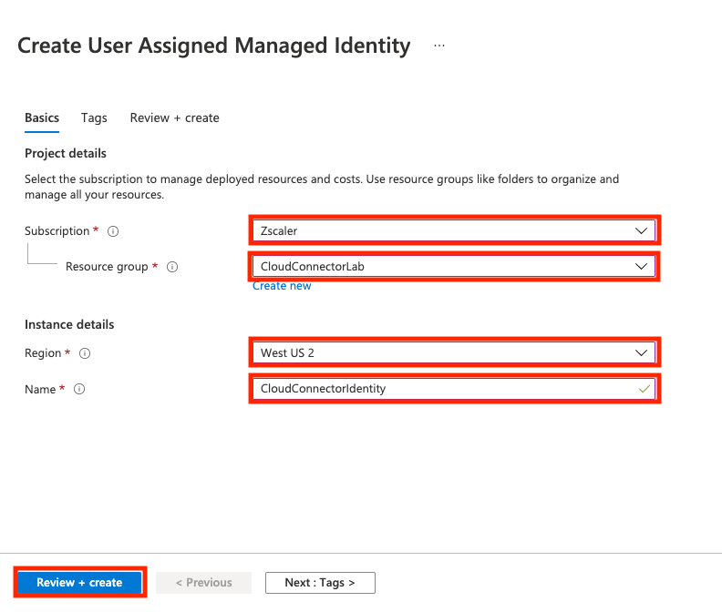

# Azure Connector Deployment

This guide will walk you through deploying a Cloud Connector in Azure. You will leverage the Cloud Connector application in the Azure marketplace to both create a VNET and deploy the Cloud Connector.

A quick overview of tasks:

- Create an Azure Key Vault with secrets that the Cloud Connector will use to authenticate with Zscaler. 

- Create a managed identity for the Cloud Connector to use with appropriate permissions and roles.

- Create a provisioning template in the Cloud Connector portal.

- Deploy the Cloud Connector application from the Azure marketplace.

## Lab Prerequisites

- You must have admin access to your own Azure account (Zscaler currently does not have Azure accounts with the appropriate permission you can leverage).

- Your own Cloud Connector tenant has been provisioned.

   >To provision a Cloud Connector tenant you will need to raise a support request at [https://help.zscaler.com/submit-ticket](https://help.zscaler.com/submit-ticket){target=_blank}. Choose **Provisioning** as the Case Type and use **your OrgID** in the Zscaler Company ID field.

## Cloud Connector Tenant

As a first step you will log into your Cloud Connector tenant and grab a couple of pieces of information to be used in Azure as well as provision a location template.  

### Login to your Tenant

>Your tenant might be on a different Zscaler domain than the one used in the wording and screenshots in the lab.  Please refer to your tenants credential information to ensure you are accessing the correct connector portal.  (You probably won't be able to log into the wrong one.)

1. Open a browser and navigate to **https://connector.`<your-tentant-domain>`.net**.  In my case this is https://connector.zscalerthree.net. 

2. Log into your Connector tenant using your credentials.  The username probably starts with **bac-admin@**.

    

### Provisioning Template

1. Create a basic provisioning template to use for deployment of the Cloud Connector. Use the left-hand navigation and select **Administration > Provisioning Templates**.

    

1. Click the **Cloud Provisioning** tab and then click **Add Cloud Connector Provisioning Template**.

    

1. Enter in information in order to create a provisioning template. Provide a name for this template, like **CloudConnectorLabAzure**, and then click **Next**.

    > Note, to click the **Next** button you may have to scroll down depending on your screen resolution. 

    

1. Select Azure and click **Next**.

    

1. Select **Default Location Template** and click **Next**.

    

1. Leave the default selection of Small and click **Next**.

    

1. Finally, review the information and click **Save**.

    

2. You now should see a message indicating **All changes have been saved**. Click the **Copy Provisioning URL** link and save the copied URL in the same place you saved the availability zone name of your subnet. You will need that URL when deploying the Cloud Connector via the CloudFormation template in preceding steps.

    

### API Key

1. You will need to grab the API key from the portal.  Click on **Administration > API Key Management**.

    

1. Copy the value under **Key** and save it.

## Azure Conventions

### Subscriptions and Region

Note: For the purposes of this lab, whenever you are asked for a subscription or region when creating a resource group or new service, like Managed Identities, Key Vaults, and Virtual Machines, use the same subscription and region every time. 

### Accessing Azure Services

There are multiple ways to locate services in Azure.  Throughout this guide we will configure a number of different services. One way to quickly locate services is by entering in text in the search box at the top of the UI. It will display a list of matching services that you can click on to access the service's landing page. Throughout the course of this guide, there will be instructions such as **navigate to Marketplace** or **Navigate to Resource Groups**, and you can use the search box (or other preferable means) to navigate to the service. 

## Azure Setup

You are going to create a resource group (A resource group is a logical structure that holds related resources) in Azure to hold your managed identity as well as your key vault. When you create a new Cloud Connector application, you will create a new resource group as well during the process.  In total, you will have two resource groups that will contain all the services associated with spinning up the Cloud Connector. The resource group will belong to a subscription, and it will be associated with a region. 

### Create Azure Resource Group

1. Create a resource group to hold your Key Vault and Managed Identity. Navigate to the **Resource groups** service and click **Create** to add a new Resource group.

    

1. Fill out the following and then click **Review + create**.

    - Subscription: Select your subscription.
    - Name: Enter in **CloudConnectorLab**
    - Region: Select your region.

    

1. Review the settings and then click **Create**.

    

### Create Managed Identity

1. Create a managed identity that the Cloud Connector will use. It will need to be able to make modifications to the network, as well as access the Key Vault you will create in later steps. Navigate to the **Managed Identities** service and click **Create** to add new managed identity.

    

1. Fill out the following information and then click **Review + create**.

    - Subscription: Select your subscription.
    - Resource Group: Choose the resource group you just created.
    - Region: Select your region.
    - Name: Enter in **CloudConnectorLab**.

    

1. Review the information and then click **Create**.

    

#### Assign Role to Managed Identity

1. Navigate to your managed identity you just created by clicking **Go to resource**.

    

1. In the left-hand navigation for this managed identity, click **Azure role assignments** and then click **Add role assignment (Preview)**.

    

1. On the modal that comes up enter the following information and then click **Save**.

    - Scope: Subscription
    - Subscription: Select the appropriate subscription.
    - Role: Input **network** into the search box, and select **Network Contributor** from the list.

    

### Create Key Vault

1. Navigate to the **Key vaults** service and click **Create** to add a new key vault.

    

1. Fill out the following information and then click the **Access policy>** tab.

    - Subscription: Select the appropriate subscription
    - Resource Group: Select resource group created earlier
    - Key Vault Name: CloudConnectorLab
    - Region: Select appropriate region
    - Pricing tier: Standard
    - Days to retain deleted vaults: 90
    - Purge protection: Disable purge protection

    

1. Check the box next to **Azure Resource Manager for template deployment**.  Select the radio button for **Vault access policy**.  Then click **+ Add Access Policy**.

    

1. Add secret permissions and select principal then click **Add**.

    - Secret permissions: Use the dropdown to select **Get** and **List**.

    - Select principal: Click **None selected** and the select **CloudConnectorLab** (type CloudConnectorLab in the search box to bring up the managed identity you create earlier.  Click on it and then click **Select** to add it to the access policy).

    

    

1. Click **Review + create** and then **Create**. Click on the **Go to resource** to access the key vault for the next step.

    

#### Add Secrets to Key Vault

You are going to add 3 secrets to the KeyVault, the API key you grabbed earlier, as well as your username and password to the Cloud Connector portal.

1. In the left-hand navigation, click on **Secrets**, and then click on **Generate/Import** to create a secret.

    

1. Enter the following information and leave all other values as the default.  Click **Create** when finished.

    - Name: **username**
    - Value: Your Cloud Connector tenant username.

    

1. Follow the same steps as above, 2 more times, to create secrets for:

    - **password**: Your Cloud Connector tenant password.
    - **api-key**: The API key from your Cloud Connector tenant.

    

### Cloud Connector Virtual Machine Public Key

When you go to deploy the Cloud Connector virtual machine, it will require an SSH key. If your Azure account already has an Azure key pair, you may skip these steps and use that key pair when launching the Cloud Connector Application. Otherwise, follow these steps to generate a new Azure Key Pair: [https://docs.microsoft.com/en-us/azure/virtual-machines/ssh-keys-portal](https://docs.microsoft.com/en-us/azure/virtual-machines/ssh-keys-portal){target=_blank}.

### Deploy the Cloud Connector Application

1. Navigate to the **Marketplace** service. In the search box for marketplace, enter in **Zscaler Cloud Connector Application** and hit **Enter**. You will likely see two or three results.  The Zscaler Cloud Connector Application is what we are interested in, as this will deploy all the services and settings to successfully launch the Cloud Connector.

    >The **Zscaler Cloud Connector** is just the virtual machine, and launching that would require you to manually set up all the configuration and related services.

1. Click **Create** on the box with Zscaler Cloud Connector Application.

    

1. On the Basics screen enter the following values and then click **Next**.

    - Subscription: Select the appropriate subscription.
    - Resource Group: Click **Create New** and enter in **CloudConnectorApp**. (You are not allowed to leverage a resource group with existing resources.)
    - Region: Select appropriate region.

    

1. On the Zscaler settings page enter the following information.

    > The provisioning URL is the one you saved from the Cloud Connector portal in earlier steps. 

    - Provisioning Template URL: Provisioning URL
    - Zscaler Cloud Connector VM Size: Leave default
    - Zscaler Cloud Connector VM Public Key: Azure Key Pair
    - Zscaler Cloud Connector VM ssh keys: Select your key
    - Zscaler Cloud Credentials Key Vault: CloudConnectorLab (This is the key vault that was created earlier.)

1. Now add the managed identity created earlier.

    - Click the **Add** button under User assigned managed identity.
    - Select the appropriate subscription.
    - Click on **CloudConnectorIdentity** and **Add** to add the managed identity.

1. Click **Next** to continue to the next step.

    

1. Click **Next** to "skip" setting up any Load Balancers.  (Unless you want to create some for your purposes.)

1. Create a new Virtual Network.  Give it a more descriptive name than the default.  Click **Next**.

    - Virtual Network: Click **Create new** and enter in **CloudConnectorLab** as the name.  Then click **Ok**.
    - zsccSubnet: Leave default.

    

    

1. Click **Next** to "skip" setting up any tags.  (Unless you want to create some for your purposes.)

1. In the last step, review your configuration and then click **Create**.  Wait as Azure deploys the Cloud Connector. When the Cloud Connector application is successfully deployed you can click into the resource group and see all the services that were created, including Virtual Network, Network Interfaces, Network Security Group, Virtual Machine, and Disk. 

    

### Verify Cloud Connector

1. It will take a few minutes, after the deployment in Azure has completed, before you see an active Cloud Connector in your Cloud Connector Tenant Dashboard.

    >When the Cloud Connector first communicates with Zscaler, you may see it as deployed, but inactive.  Give it up to 5 minutes to turn active.

    

1. You now have successfully deployed the Cloud Connector to Azure and have completed the lab.

    

### Optional Steps and Cleanup

Below are some optional steps you can complete on your own to continue getting familiar with the Cloud Connector. Also, after you are done testing, you may want to delete the Cloud Connector application so as not to run up your Azure bill.  

- Create workloads in Azure and route them through the Cloud Connector.

### Cleanup

1. Navigate to the CloudConnectorApp resource group, and click **Delete Resource group** button. This will delete the Cloud Connector virtual machine and all the other services associated with it (Disk, Network Interfaces, etc.). You will also see a NetworkWatcherRG resource group that was created when you deployed the Cloud Connector application, feel free to delete this resource group. 

1. You may want to leave the CloudConnectorLab resource group, which contains the Key Vault and Managed Identity, if you plan on needing to deploy additional Cloud Connectors in the future. As of the time of this writing, there is no cost associated with Key Vault secrets nor managed identities.
